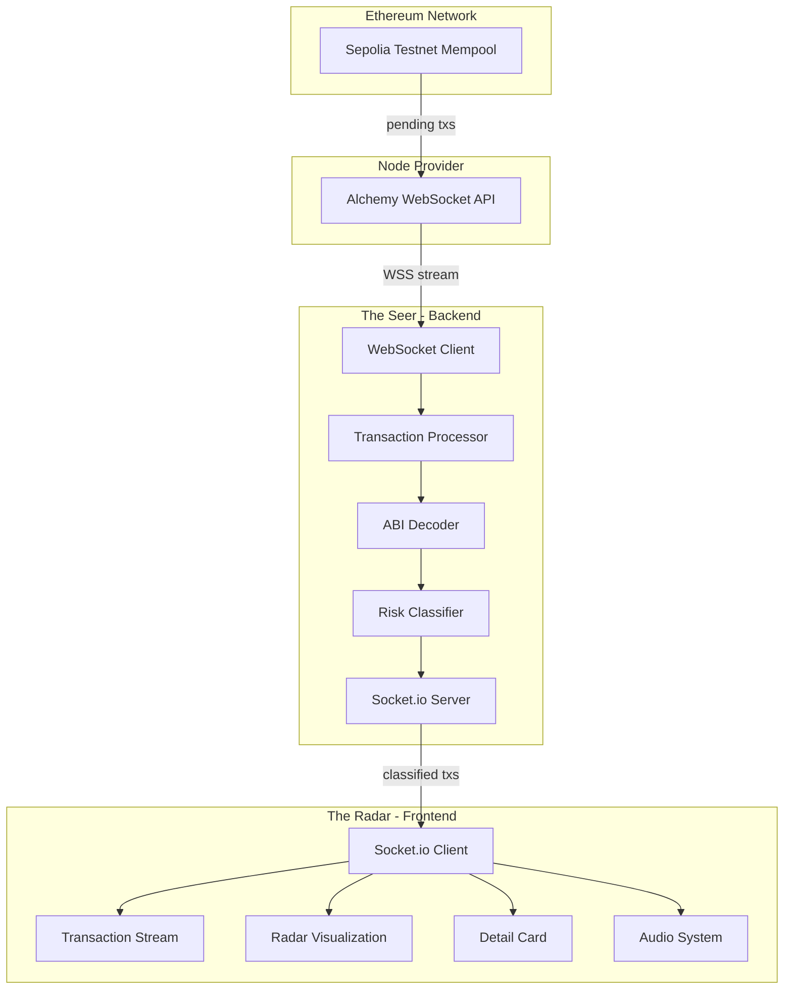
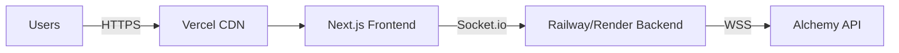

# Design Document

## Overview

The MEV Exorcist is a full-stack real-time monitoring application consisting of two primary components: The Seer (backend) and The Radar (frontend). The system monitors the Ethereum Sepolia testnet mempool for pending Uniswap V3 swap transactions, classifies them by MEV risk level, and presents them through a cyber-horror themed interface with dramatic visual and audio feedback.

The architecture follows a client-server model with WebSocket-based bidirectional communication. The backend maintains a persistent connection to Alchemy's WebSocket API to receive pending transactions, filters and analyzes them, then broadcasts classified transactions to connected frontend clients via Socket.io. The frontend renders transactions in real-time with risk-appropriate styling, animations, and sound effects.

## Architecture

### System Architecture Diagram



### Technology Stack

**Backend (The Seer):**
- Runtime: Node.js (v18+)
- WebSocket Client: ws library for Alchemy connection
- Real-time Server: Socket.io for frontend communication
- ABI Decoding: ethers.js v6
- Environment: dotenv for configuration

**Frontend (The Radar):**
- Framework: Next.js 14 (React 18)
- Real-time Client: socket.io-client
- Styling: Tailwind CSS with custom cyber-horror theme
- Animations: Framer Motion
- Audio: Web Audio API

### Deployment Architecture



## Components and Interfaces

### Backend Components

#### 1. WebSocket Client Manager

**Responsibility:** Establish and maintain persistent connection to Alchemy WebSocket API.

**Interface:**
```typescript
class AlchemyWebSocketClient {
  constructor(url: string)
  connect(): Promise<void>
  subscribe(event: 'pendingTransactions'): void
  on(event: string, handler: (data: any) => void): void
  reconnect(): Promise<void>
}
```

**Key Methods:**
- `connect()`: Establishes WebSocket connection with error handling
- `subscribe()`: Subscribes to pending transaction stream
- `reconnect()`: Implements exponential backoff reconnection logic (1s, 2s, 4s, 8s, max 30s)

#### 2. Transaction Processor

**Responsibility:** Fetch full transaction details and filter by target address.

**Interface:**
```typescript
class TransactionProcessor {
  constructor(provider: ethers.JsonRpcProvider, targetAddress: string)
  async processTransactionHash(txHash: string): Promise<Transaction | null>
  isTargetTransaction(tx: Transaction): boolean
}
```

**Key Methods:**
- `processTransactionHash()`: Fetches transaction details from Alchemy
- `isTargetTransaction()`: Checks if transaction targets Uniswap V3 Router

#### 3. ABI Decoder

**Responsibility:** Decode transaction input data using Uniswap V3 ABI.

**Interface:**
```typescript
class ABIDecoder {
  constructor(abi: any[])
  decode(inputData: string): DecodedTransaction | null
  isSwapFunction(functionName: string): boolean
}
```

**Key Methods:**
- `decode()`: Parses hex input data into function name and parameters
- `isSwapFunction()`: Identifies swap-related function calls

#### 4. Risk Classifier

**Responsibility:** Analyze decoded transactions and assign risk levels.

**Interface:**
```typescript
class RiskClassifier {
  classify(tx: DecodedTransaction): ClassifiedTransaction
  calculateRiskLevel(ethValue: bigint): 'HIGH' | 'LOW'
}
```

**Key Methods:**
- `classify()`: Extracts relevant data and assigns risk level
- `calculateRiskLevel()`: Applies threshold logic (>0.1 ETH = HIGH)

#### 5. Socket.io Server

**Responsibility:** Broadcast classified transactions to connected frontend clients.

**Interface:**
```typescript
class TransactionBroadcaster {
  constructor(port: number)
  start(): void
  broadcast(transaction: ClassifiedTransaction): void
  getConnectedClients(): number
}
```

**Events Emitted:**
- `transaction`: Sends classified transaction data to all clients

### Frontend Components

#### 1. Socket.io Client Hook

**Responsibility:** Manage WebSocket connection to backend and receive transactions.

**Interface:**
```typescript
function useTransactionStream(backendUrl: string) {
  return {
    transactions: ClassifiedTransaction[],
    isConnected: boolean,
    error: string | null
  }
}
```

#### 2. Transaction Stream Component

**Responsibility:** Display scrolling list of transactions with risk-based styling.

**Props:**
```typescript
interface TransactionStreamProps {
  transactions: ClassifiedTransaction[]
  maxItems: number
  onTransactionClick: (tx: ClassifiedTransaction) => void
}
```

**Styling Logic:**
- LOW risk: Gray text (#6B7280), no border
- HIGH risk: Red text (#FF0000), pulsing red border animation

#### 3. Radar Visualization Component

**Responsibility:** Animated circular radar that reacts to MEV threats.

**Props:**
```typescript
interface RadarProps {
  alertState: 'normal' | 'alert'
  onAlertStateChange: (state: 'normal' | 'alert') => void
}
```

**Animation States:**
- Normal: Slow rotation (10s per revolution), green (#00FF00)
- Alert: Fast rotation (2s per revolution), red (#FF0000), maintained for 3s

#### 4. Detail Card Component

**Responsibility:** Display detailed information about high-risk transactions.

**Props:**
```typescript
interface DetailCardProps {
  transaction: ClassifiedTransaction | null
  onClose: () => void
}
```

**Display Fields:**
- Victim address (truncated: 0x1234...5678)
- ETH value (4 decimal precision)
- Transaction hash (clickable Etherscan link)
- Status: "HUNTED" label

#### 5. Audio System Hook

**Responsibility:** Play sound effects based on transaction risk level.

**Interface:**
```typescript
function useAudioFeedback() {
  return {
    playTick: () => void,
    playSiren: () => void,
    isEnabled: boolean,
    setEnabled: (enabled: boolean) => void
  }
}
```

**Sound Effects:**
- Tick: 100ms sine wave at 800Hz
- Siren: 500ms oscillating square wave 400-800Hz

## Data Models

### Transaction Data Flow

```typescript
// Raw transaction from Alchemy
interface RawTransaction {
  hash: string
  from: string
  to: string | null
  value: string
  input: string
  gasPrice: string
  gas: string
}

// Decoded transaction after ABI parsing
interface DecodedTransaction {
  hash: string
  from: string
  to: string
  value: bigint
  functionName: string
  parameters: {
    amountIn?: bigint
    amountOutMin?: bigint
    path?: string[]
    recipient?: string
    deadline?: number
  }
}

// Classified transaction sent to frontend
interface ClassifiedTransaction {
  hash: string
  from: string
  ethValue: string // formatted with 4 decimals
  riskLevel: 'HIGH' | 'LOW'
  timestamp: number
  functionName: string
}
```

### Configuration Models

```typescript
// Backend environment configuration
interface BackendConfig {
  ALCHEMY_WSS_URL: string
  UNISWAP_V3_ROUTER: string
  PORT: number
  RISK_THRESHOLD_ETH: string
}

// Frontend environment configuration
interface FrontendConfig {
  NEXT_PUBLIC_BACKEND_URL: string
  NEXT_PUBLIC_ETHERSCAN_BASE: string
}
```

## Correctness Properties

*A property is a characteristic or behavior that should hold true across all valid executions of a system-essentially, a formal statement about what the system should do. Properties serve as the bridge between human-readable specifications and machine-verifiable correctness guarantees.*

### Property 1: Transaction detail fetching consistency

*For any* transaction hash received by The Seer, the system should fetch the complete transaction details from the node provider.
**Validates: Requirements 1.3**

### Property 2: Router address filtering

*For any* transaction received by The Seer, the system should check if the recipient address matches the Uniswap V3 Router address.
**Validates: Requirements 2.1**

### Property 3: Non-router transaction filtering

*For any* transaction that does not target the Uniswap V3 Router, The Seer should discard it without further processing.
**Validates: Requirements 2.2**

### Property 4: Router transaction decoding

*For any* transaction targeting the Uniswap V3 Router, The Seer should attempt to decode the transaction input data using the Uniswap V3 ABI.
**Validates: Requirements 2.3**

### Property 5: Swap parameter extraction

*For any* decoded transaction containing a swap function call, the system should extract the swap parameters for analysis.
**Validates: Requirements 2.5**

### Property 6: ETH value extraction

*For any* swap transaction decoded by The Seer, the system should extract the ETH value being swapped.
**Validates: Requirements 3.1**

### Property 7: High-risk classification threshold

*For any* swap transaction with value exceeding 0.1 ETH, the system should classify it as "High Risk MEV Target".
**Validates: Requirements 3.2**

### Property 8: Low-risk classification threshold

*For any* swap transaction with value below 0.1 ETH, the system should classify it as "Low Risk".
**Validates: Requirements 3.3**

### Property 9: High-risk data extraction completeness

*For any* transaction classified as High Risk, The Seer should extract the sender address, transaction hash, ETH value, and risk level.
**Validates: Requirements 3.4**

### Property 10: Transaction broadcast consistency

*For any* classified transaction, The Seer should broadcast the transaction data to all connected frontend clients.
**Validates: Requirements 3.5**

### Property 11: Low-risk transaction styling

*For any* Low Risk transaction received by The Radar, the system should display it with gray styling in the transaction stream.
**Validates: Requirements 4.3**

### Property 12: High-risk transaction styling

*For any* High Risk transaction received by The Radar, the system should display it with red styling and a pulsing border.
**Validates: Requirements 4.4**

### Property 13: Transaction stream size limit

*For any* transaction stream that exceeds 50 items, The Radar should remove the oldest transactions to maintain the limit.
**Validates: Requirements 4.5**

### Property 14: High-risk transaction color consistency

*For any* High Risk transaction displayed, the system should use blood red color (#FF0000) for text and borders.
**Validates: Requirements 5.2**

### Property 15: Low-risk transaction color consistency

*For any* Low Risk transaction displayed, the system should use matrix green color (#00FF00) for text.
**Validates: Requirements 5.3**

### Property 16: Radar alert state transition

*For any* High Risk transaction detected, the radar should change to red color and increase rotation speed.
**Validates: Requirements 6.3**

### Property 17: Continuous alert state maintenance

*For any* sequence of multiple High Risk transactions occurring rapidly, the radar should remain in alert state continuously.
**Validates: Requirements 6.5**

### Property 18: Detail card display trigger

*For any* High Risk transaction detected, The Radar should display a detail card overlay.
**Validates: Requirements 7.1**

### Property 19: Address truncation format

*For any* wallet address displayed in the detail card, the system should show it in truncated format (0x1234...5678).
**Validates: Requirements 7.2**

### Property 20: ETH value precision

*For any* ETH value displayed in the detail card, the system should format it with exactly 4 decimal precision.
**Validates: Requirements 7.3**

### Property 21: Etherscan link generation

*For any* transaction hash displayed in the detail card, the system should render it as a clickable link to Etherscan.
**Validates: Requirements 7.4**

### Property 22: Low-risk audio feedback

*For any* Low Risk transaction detected, The Radar should trigger the tick sound effect.
**Validates: Requirements 8.1**

### Property 23: High-risk audio feedback

*For any* High Risk transaction detected, The Radar should trigger the siren sound effect.
**Validates: Requirements 8.2**

### Property 24: Audio queuing for rapid transactions

*For any* sequence of multiple High Risk transactions occurring rapidly, the system should queue sound effects to prevent overlap.
**Validates: Requirements 8.5**

## Error Handling

### Backend Error Handling

**WebSocket Connection Errors:**
- Connection failure: Log error, attempt reconnection with exponential backoff (1s, 2s, 4s, 8s, 16s, max 30s)
- Connection timeout: Treat as connection failure, trigger reconnection
- Unexpected disconnection: Log event, trigger immediate reconnection attempt

**Transaction Processing Errors:**
- Transaction fetch failure: Log error with transaction hash, continue processing other transactions
- ABI decoding failure: Log error with transaction hash and input data, continue processing
- Invalid transaction format: Log warning, discard transaction, continue processing

**Broadcasting Errors:**
- Socket.io client disconnection: Remove client from active connections list
- Broadcast failure: Log error, attempt to send to remaining clients

### Frontend Error Handling

**Connection Errors:**
- Initial connection failure: Display error message "Unable to connect to MEV Exorcist backend. Retrying..."
- Connection timeout: Retry connection after 5 seconds, max 3 attempts
- Disconnection during operation: Display warning banner, attempt automatic reconnection

**Rendering Errors:**
- Invalid transaction data: Log error, skip rendering that transaction
- Animation failure: Fallback to static display, log error
- Audio playback failure: Continue with visual notifications only, log error

**User Input Errors:**
- Audio permission denied: Disable audio system, show notification "Audio disabled - visual alerts only"
- Browser compatibility issues: Display warning message with supported browser list

## Testing Strategy

### Unit Testing

The application will use **Jest** as the primary testing framework for both backend and frontend unit tests.

**Backend Unit Tests:**
- WebSocket client connection and reconnection logic
- Transaction filtering by router address
- ABI decoding with valid and invalid input data
- Risk classification threshold logic (0.1 ETH boundary)
- Socket.io broadcasting to multiple clients
- Configuration loading from environment variables

**Frontend Unit Tests:**
- Socket.io client connection handling
- Transaction stream rendering with different risk levels
- Transaction list size management (50 item limit)
- Address truncation formatting
- ETH value formatting with 4 decimal precision
- Etherscan link generation
- Audio system enable/disable logic

**Test Coverage Goals:**
- Backend core logic: >80% coverage
- Frontend components: >70% coverage
- Critical paths (transaction processing, risk classification): 100% coverage

### Property-Based Testing

The application will use **fast-check** for property-based testing in TypeScript.

**Property Test Configuration:**
- Minimum iterations per property: 100 runs
- Each property test must include a comment tag referencing the design document property
- Tag format: `// Feature: mev-exorcist, Property {number}: {property_text}`

**Backend Property Tests:**

1. **Transaction Filtering Property** (Property 2, 3)
   - Generate random transactions with various recipient addresses
   - Verify only Uniswap V3 Router transactions are processed
   - Verify non-router transactions are discarded

2. **Risk Classification Property** (Property 7, 8)
   - Generate random ETH values (0 to 10 ETH)
   - Verify values >0.1 ETH classified as HIGH
   - Verify values <0.1 ETH classified as LOW
   - Test boundary: exactly 0.1 ETH

3. **Data Extraction Completeness Property** (Property 9)
   - Generate random high-risk transactions
   - Verify all required fields present: sender, hash, value, risk level
   - Verify no fields are null or undefined

**Frontend Property Tests:**

1. **Styling Consistency Property** (Property 11, 12, 14, 15)
   - Generate random transactions with HIGH and LOW risk levels
   - Verify HIGH risk always renders with red (#FF0000)
   - Verify LOW risk always renders with green (#00FF00)

2. **Stream Size Management Property** (Property 13)
   - Generate random number of transactions (0 to 100)
   - Verify stream never exceeds 50 items
   - Verify oldest items removed first (FIFO)

3. **Formatting Property** (Property 19, 20)
   - Generate random wallet addresses
   - Verify truncation format: 0x{first4}...{last4}
   - Generate random ETH values
   - Verify exactly 4 decimal places in output

**Property Test Generators:**

```typescript
// Example generator for transactions
const arbitraryTransaction = fc.record({
  hash: fc.hexaString({ minLength: 64, maxLength: 64 }),
  from: fc.hexaString({ minLength: 40, maxLength: 40 }).map(s => '0x' + s),
  to: fc.hexaString({ minLength: 40, maxLength: 40 }).map(s => '0x' + s),
  value: fc.bigInt({ min: 0n, max: 10000000000000000000n }), // 0-10 ETH in wei
})

// Example generator for ETH values
const arbitraryEthValue = fc.double({ min: 0, max: 10, noNaN: true })
```

### Integration Testing

**Backend Integration Tests:**
- End-to-end flow: Mock Alchemy WebSocket → Process transaction → Broadcast to Socket.io clients
- Test with real Uniswap V3 ABI and sample transaction data
- Verify reconnection behavior with simulated connection drops

**Frontend Integration Tests:**
- End-to-end flow: Mock Socket.io connection → Receive transaction → Render UI → Play audio
- Test with various transaction sequences (all LOW, all HIGH, mixed)
- Verify radar state transitions with rapid transaction sequences

### Manual Testing Checklist

- [ ] Deploy backend to Railway/Render and verify WebSocket connection to Alchemy
- [ ] Deploy frontend to Vercel and verify Socket.io connection to backend
- [ ] Monitor real Sepolia testnet transactions for 10 minutes
- [ ] Verify audio plays correctly on first user interaction
- [ ] Test on multiple browsers (Chrome, Firefox, Safari)
- [ ] Test on mobile devices (responsive design)
- [ ] Verify Etherscan links open correctly
- [ ] Test with audio disabled
- [ ] Verify error messages display correctly on connection failure

## Performance Considerations

**Backend Performance:**
- Transaction processing should complete within 50ms per transaction
- Support minimum 100 concurrent WebSocket connections
- Memory usage should not exceed 512MB under normal load
- Implement transaction queue if processing falls behind (max queue size: 1000)

**Frontend Performance:**
- Initial page load should complete within 2 seconds
- Transaction rendering should not block UI thread
- Limit DOM nodes by capping transaction stream at 50 items
- Use CSS transforms for animations (GPU acceleration)
- Debounce rapid transaction updates (max 60 FPS)

**Network Optimization:**
- Compress Socket.io messages using built-in compression
- Send only essential transaction data to frontend
- Implement heartbeat to detect stale connections (30s interval)

## Security Considerations

**Backend Security:**
- Validate all environment variables on startup
- Sanitize transaction data before broadcasting
- Implement rate limiting on Socket.io connections (max 10 connections per IP)
- Use WSS (secure WebSocket) for Alchemy connection
- Never expose Alchemy API key in logs or error messages

**Frontend Security:**
- Validate all incoming Socket.io messages
- Sanitize transaction data before rendering (prevent XSS)
- Use HTTPS for all external links (Etherscan)
- Implement Content Security Policy headers
- Never store sensitive data in localStorage

## Deployment Configuration

### Backend Deployment (Railway/Render)

**Environment Variables:**
```bash
ALCHEMY_WSS_URL=wss://eth-sepolia.g.alchemy.com/v2/YOUR_API_KEY
UNISWAP_V3_ROUTER=0xE592427A0AEce92De3Edee1F18E0157C05861564
PORT=3001
RISK_THRESHOLD_ETH=0.1
NODE_ENV=production
```

**Build Configuration:**
```json
{
  "build": {
    "command": "npm install && npm run build"
  },
  "start": {
    "command": "npm run start"
  }
}
```

**Health Check Endpoint:**
- Path: `/health`
- Response: `{ "status": "ok", "connections": number, "uptime": number }`

### Frontend Deployment (Vercel)

**Environment Variables:**
```bash
NEXT_PUBLIC_BACKEND_URL=https://mev-exorcist-backend.railway.app
NEXT_PUBLIC_ETHERSCAN_BASE=https://sepolia.etherscan.io
```

**Build Configuration:**
```json
{
  "buildCommand": "npm run build",
  "outputDirectory": ".next",
  "framework": "nextjs"
}
```

**Vercel Configuration (vercel.json):**
```json
{
  "headers": [
    {
      "source": "/(.*)",
      "headers": [
        {
          "key": "Content-Security-Policy",
          "value": "default-src 'self'; connect-src 'self' wss://* https://*; style-src 'self' 'unsafe-inline';"
        }
      ]
    }
  ]
}
```

## Development Workflow

### Local Development Setup

1. **Backend Setup:**
   ```bash
   cd backend
   npm install
   cp .env.example .env
   # Edit .env with Alchemy API key
   npm run dev
   ```

2. **Frontend Setup:**
   ```bash
   cd frontend
   npm install
   cp .env.local.example .env.local
   # Edit .env.local with backend URL
   npm run dev
   ```

### Testing Workflow

1. Run unit tests: `npm test`
2. Run property tests: `npm run test:property`
3. Run integration tests: `npm run test:integration`
4. Check coverage: `npm run test:coverage`

### Deployment Workflow

1. **Backend Deployment:**
   - Push to `main` branch
   - Railway/Render auto-deploys
   - Verify health check endpoint
   - Monitor logs for errors

2. **Frontend Deployment:**
   - Push to `main` branch
   - Vercel auto-deploys
   - Verify preview deployment
   - Promote to production

## Future Enhancements

- Support multiple DEX protocols (Uniswap V2, SushiSwap, Curve)
- Add historical MEV attack database
- Implement machine learning for MEV prediction
- Add user accounts and alert preferences
- Support Ethereum mainnet monitoring
- Add transaction simulation to predict MEV profit
- Implement dark pool detection
- Add mobile app (React Native)
